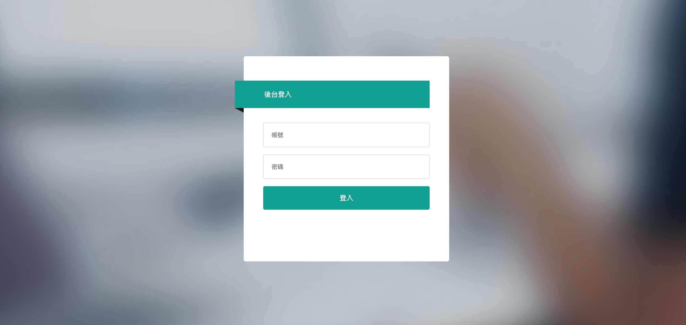
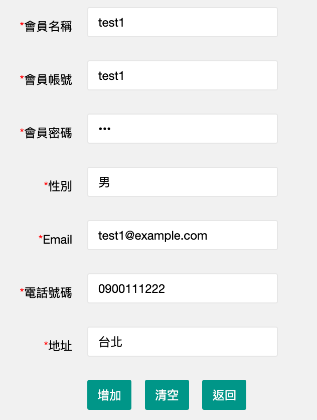
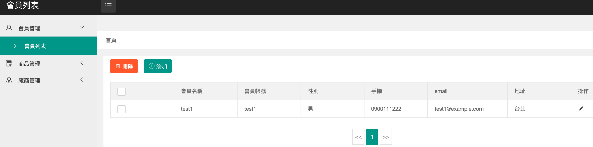
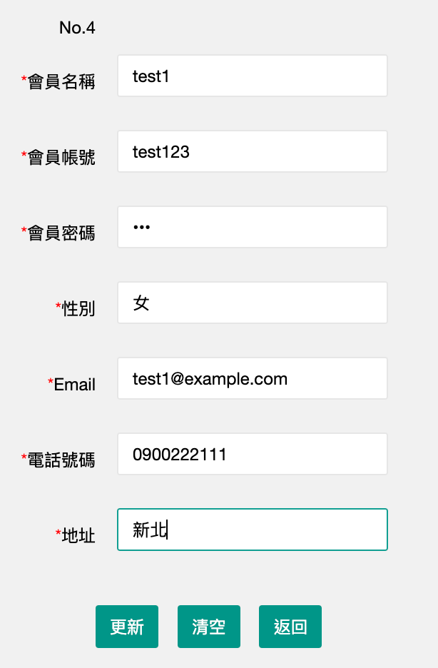
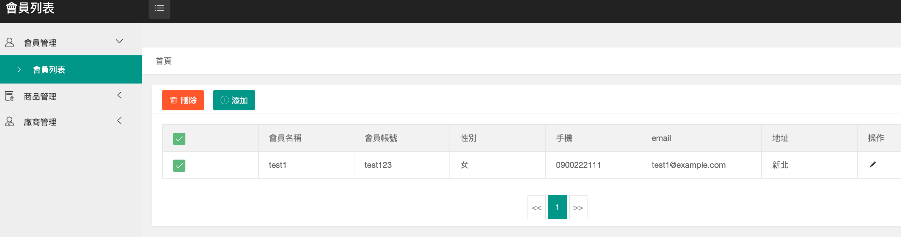
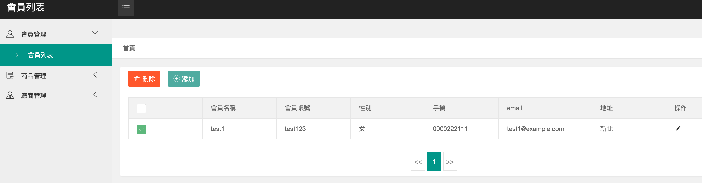
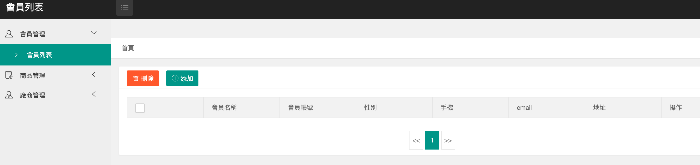

# 線上網站

線上版本：https://agile-cliffs-84065.herokuapp.com   

帳號：admin@example.com 

密碼：12345678   

使用技術   
資料庫：MySQL   
框架：Node.js / Express.js   
版本控管：git, github
雲端：heroku

功能   
1.登入驗證   

   

若帳密為空白  
    

若帳密輸入錯誤   
    

輸入正確 進入首頁   
    

2.點擊添加 新增資料   
    
    
新增完成
      

3.點擊操作圖示 修改資料   

   

   

4.刪除資料    
    
可一次全勾選
   
    
可單筆勾選
   
    
刪除完成
    

